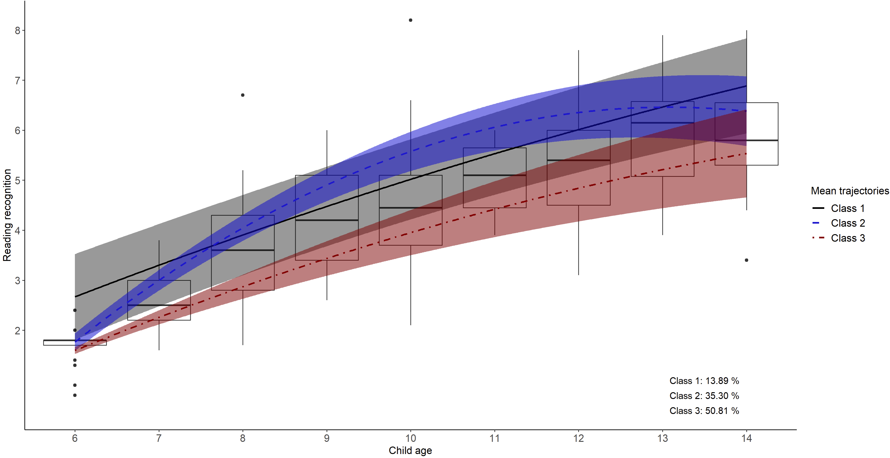
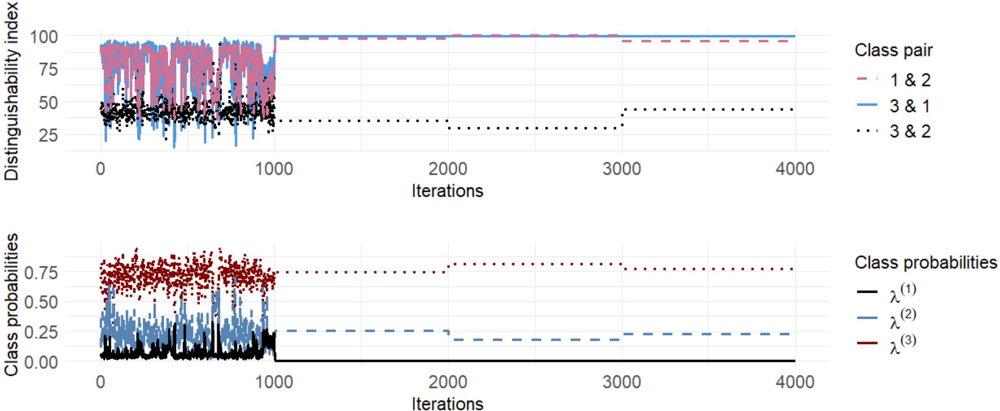

# Bayesian Identification and Estimation of Growth Mixture Models
This repository provides Stan code for fitting Growth Mixture Models (GMMs) and includes diagnostics and graphs described in our paper (link will be provided upon publication).


## Contents

- Graphs: Provides code to visualize within-class heterogeneity using real data from the NLSY (National Longitudinal Survey of Youth), including class-specific mean trajectories with shaded 50% mid-range and box plots of reading scores. Additionally, it includes graphs visualizing simulation results.
- Diagnostics for Problematic Behaviors: Includes functions to diagnose stuck sequences, twinlike-class behaviors, and minuscule-class issues.
- Stan Code: Contains Stan code to implement GMMs using fully marginal likelihood and addressing label switching by relabeling techniques.

## Stan setup

You can find instructions in the [Getting started with CmdStanR](https://mc-stan.org/cmdstanr/articles/cmdstanr.html) vignette.
```ruby
# Installing CmdStan
library(rstan)
library(cmdstanr)
check_cmdstan_toolchain(fix = TRUE, quiet = TRUE)

# Install CmdStan with a specified number of cores
install_cmdstan(cores = 4)  # Insert your number of cores
#set_cmdstan_path(path ="")
cmdstan_path()  # Check the path where CmdStan is installed
cmdstan_version()  # Check the version of CmdStan installed
```


## Visualizing within-class heterogeneity using NLSY data

<details>
<summary>Three-Class Model Fitting with NLSY Data</summary>

This section includes functions to read the NLSY data, compile and run the Stan model, and handle label switching.
### 1. Reading the NLSY data
We start by reading the dataset, checking for missing values, and removing any rows with missing data.

```ruby
# Load required packages
library(haven)  # For reading .sav files
library(dplyr)  # For data manipulation
# Read the dataset
CurranLong <- read_sav("NLSY_data_application/CurranLong.sav")
# Check for missing values
sum(is.na(CurranLong))
# Remove rows with missing data
CurranLong_nm <- na.omit(CurranLong)
# Display the first few rows of the cleaned dataset
head(CurranLong_nm)
```
### 2. Compiling the Stan model
We compile a GMM with marginal likelihood using Stan.
```ruby
# Specify the path to the Stan model file
sq_GMM_ML_file <- file.path(cmdstan_path(), "GMM_ML.stan")
# Compile the Stan model
sq_GMM_ML_mod <- cmdstan_model(sq_GMM_ML_file)
```
### 3. Preparing data for the Stan model
We prepare a data list for fitting the Stan model. In this example, we fit a GMM with a Dirichlet prior (concentration parameter $\alpha = 10$) for the class probability parameters (i.e., D10) and a Half-Normal prior (scale parameter $\gamma = 50$) for the random-intercept and random-slope standard deviations (i.e., N50).
```ruby
# Function to prepare data list for Stan model
sq_GMMs_data_list <- function(GMM_dat, K) {
  # Calculate the cluster size for each subject
  cluster_size = GMM_dat %>% group_by(id) %>% 
    summarise(cluster_size = n()) %>% 
    pull(cluster_size)
  # Create a list of data to be passed to the Stan model
  GMM_list <- list(
    Subject = as.numeric(factor(GMM_dat$id, labels = 1:length(unique(GMM_dat$id)))),
    y = GMM_dat$read,
    time = GMM_dat$kidage6,
    time_sq = GMM_dat$kidagesq,
    X1 = GMM_dat$kidgen,
    Z1 = GMM_dat$kidgen,
    N = nrow(GMM_dat),
    J = length(unique(GMM_dat$id)),
    s = cluster_size,
    K = K,
    Dir_alpha = 10.0,
    Normal_scale = 50,
    eta = 2
  )
  return(GMM_list)
}
```
### 4. Running the Stan model
We fit a three-class GMM to the NLSY data using 5 chains, each running 1,000 iterations. We use a smaller step size of 0.01 and save the warmup iterations.
```ruby
# Fit the Stan model
GMM_ML_fit_3c <- sq_GMM_ML_mod$sample(
  data = sq_GMMs_data_list(CurranLong_nm, K = 3),
  chains = 5,
  parallel_chains = 4,
  iter_sampling = 1000,
  refresh = 1000,  
  save_warmup = TRUE,
  step_size = 0.01
)
# Save the Stan object for later usage
GMM_ML_fit_3c$save_object("GMM_ML_fit_3c_D10N50.rds")
```
### 5. Handling label switching
After obtaining the Stan object, we handle label switching. This involves post-processing the MCMC samples to ensure that the labels are consistent across iterations and chains.
```ruby
# Define constants
K = 3  # Number of classes
m = 5000  # Number of chains * number of iterations
S = 405  # Number of level-2 subjects
J = 8  # Number of parameters needed for post-hoc relabeling  
var3 <- c("lambda", "mu_intercept", "mu_slope", "sq_mu_slope", 
          "sigma_e", "Omega[1,1,2]", "Omega[2,1,2]", "Omega[3,1,2]", 
          "sigma_u[1,1]", "sigma_u[1,2]", "sigma_u[2,1]", "sigma_u[2,2]",
          "sigma_u[3,1]", "sigma_u[3,2]", "pred_class_dis", "pred_class", "lp__")

# Extract posterior samples for the specified variables
post_par_3c <- GMM_ML_fit_3c$draws(format = "df", variable = "pred_class") 
post_par <- GMM_ML_fit_3c$draws(format = "df", variable = var3)

# Prepare arrays for post-processing
post_par_3c_1 <- post_par_3c %>% select(ends_with('1]')) %>% as.matrix()
post_par_3c_2 <- post_par_3c %>% select(ends_with('2]')) %>% as.matrix()
post_par_3c_3 <- post_par_3c %>% select(ends_with('3]')) %>% as.matrix()
post_class_p <- array(c(post_par_3c_1, post_par_3c_2, post_par_3c_3), dim = c(m, S, 3))

post_class <- array(data = NA, dim = c(m, S))
for (i in 1:m) {
  post_class[i, ] <- apply(post_class_p[i, , ], MARGIN = 1, which.max)
}
# Initialize MCMC arrays
mcmc <- array(data = NA, dim = c(m, K, J + S))
# Fill MCMC arrays with posterior samples
mcmc[, 1, 1] <- post_par$`lambda[1]`
mcmc[, 2, 1] <- post_par$`lambda[2]`
mcmc[, 3, 1] <- post_par$`lambda[3]`
mcmc[, 1, 2] <- post_par$`mu_intercept[1]`
mcmc[, 2, 2] <- post_par$`mu_intercept[2]`
mcmc[, 3, 2] <- post_par$`mu_intercept[3]`
mcmc[, 1, 3] <- post_par$`mu_slope[1]`
mcmc[, 2, 3] <- post_par$`mu_slope[2]`
mcmc[, 3, 3] <- post_par$`mu_slope[3]`
mcmc[, 1, 4] <- post_par$`Omega[1,1,2]`
mcmc[, 2, 4] <- post_par$`Omega[2,1,2]`
mcmc[, 3, 4] <- post_par$`Omega[3,1,2]`
mcmc[, 1, 5] <- post_par$`sigma_u[1,1]`
mcmc[, 2, 5] <- post_par$`sigma_u[2,1]`
mcmc[, 3, 5] <- post_par$`sigma_u[3,1]`
mcmc[, 1, 6] <- post_par$`sigma_u[1,2]`
mcmc[, 2, 6] <- post_par$`sigma_u[2,2]`
mcmc[, 3, 6] <- post_par$`sigma_u[3,2]`
mcmc[, , 7] <- post_par$sigma_e
mcmc[, 1, 8] <- post_par$`sq_mu_slope[1]`
mcmc[, 2, 8] <- post_par$`sq_mu_slope[2]`
mcmc[, 3, 8] <- post_par$`sq_mu_slope[3]`
for (i in 1:S) {
  mcmc[, 1, i + 8] <- as.matrix(post_par)[, paste('pred_class[', i, ',1]', sep = '')]
  mcmc[, 2, i + 8] <- as.matrix(post_par)[, paste('pred_class[', i, ',2]', sep = '')]
  mcmc[, 3, i + 8] <- as.matrix(post_par)[, paste('pred_class[', i, ',3]', sep = '')]
}  
# Source post-processing script
source("Sim_result+example/PostProcessing_list.R")
# Apply post-processing to handle label switching
fit_permuted_3c <- post_processing(chains = 5, iteration = 1000, K = 3, J = J + S, post_class, mcmc, post_class_p, post_par)
# Save the processed results
saveRDS(fit_permuted_3c, "NLSY_ageApp/fit_permuted_3c_D10N100_d.rds")
```
</details>

<details>
<summary>Visualizing within-class heterogeneity using the NLSY data</summary>
This section includes code to visualize class-specific mean trajectories with shaded 50% mid-ranges and box plots of reading scores. The detailed code is available in the [application graphs code](NLSY_data_application/Application_diagnostics_graphs.code.R).


</details>


## Diagnostics for Problematic Behaviors

Our simulated data was generated from a three-class GMM data-generating model using parameter estimates from a well-behaved solution with the NLSY data, where the occasion serves as the time variable. We then fit a three-class GMM with priors D2C5 (Dirichlet prior with concentration parameter 2 and half-Cauchy prior with scale parameter 5), which are vague/diffuse priors. This setup highlights the identification problem emphasized in our paper. The purpose is to demonstrate how to apply the recommended diagnostics to this D2C5 example.

<details>
<summary>Fitting GMM to simulated datasets</summary>

This section includes functions to simulate datasets, compile and run the Stan model, and handle label switching. Detailed code and information are available in the [simulation design code.](Simulation_study/Sim_design.code.R) 

### 1. simulate dataset
`data_fun_MCMC` is a function to generate simulated data for MCMC. Refer to the [simulation code](Simulation_study/SimCode.source.R) for more details.
```ruby
# Load saved simulated datasets
data_files <- list.files("~/SimDat", 
                         full.names = TRUE,
                         pattern = "SimulatedData_a")  # Identify file names

SimDat <- data_files %>% 
  map(function(path) {
    read_csv(path)  # Read each dataset into a list
  })   
```
### 2. Running model
`Stan_D2C5` is a function to run MCMC with a Dirichlet prior with a concentration parameter of 2 and a Half-Cauchy prior with a scale of 5. Detailed code can be found in the [MCMC code.](Simulation_study/MCMC.source.R)
```ruby

# Compiling a GMM with marginal likelihood
sq_GMM_ML_file <- file.path(cmdstan_path(), "GMM_ML.stan")
sq_GMM_ML_mod <- cmdstan_model(sq_GMM_ML_file)

# Saving Stan objects for each dataset
for (i in 1:length(SimDat)) {
  source("~/MCMC.source.R")  # Source the R script containing Stan_D2C5 function
  setwd("~/BayesIdentify/MCMCResults_D2C5")  # Set working directory for saving results
  Stan_D2C5(SimDat[[i]], K = 3)$save_object(sprintf("Stan_a%i.rds", i))  # Save Stan objects
}

```

### 3. Handling label switching
`pp_sss` is a label switching function that takes a Stan fit object, the number of chains, and the number of iterations as inputs.

</details>


<details>
<summary>Diagnostics for Problematic Behaviors</summary>

In this section, we outline four steps of our recommended diagnostic process to identify problematic behaviors (i.e., persistently stuck sequences/chains, miniscule-class sequences, and twinlike-class chains). The code to run these diagnostics can be found in [simulation diagnostics example code.](Simulation_study/Sim_result_example/Sim_diagnostics_example.code.R)

```ruby
# Load saved simulated datasets
data_files <- list.files("~/Simulation_study/SimDat", full.names = TRUE, pattern = "SimulatedData_a")
SimDat <- data_files %>% map(read_csv)

# Function to read MCMC results from a directory
read_Stan_in_directory <- function(directory) {
  file_paths <- list.files(directory, full.names = TRUE, pattern = "Stan_a")
  file_contents <- map(file_paths, readRDS)
  return(file_contents)
}
# Function to read files from a specific subdirectory
read_files_in_directory <- function(subdirectory) {
  directory <- paste("Simulation_study/MCMCResults_", subdirectory, sep = "")
  file_paths <- list.files(directory, full.names = TRUE, pattern = "rep_a")
  file_contents <- map(file_paths, readRDS)
  
  # Read the log likelihood file
  log_l_path <- file.path(directory, "log_l.rds")
  log_l <- readRDS(log_l_path)
  
  return(list(log_l = log_l, priors = file_contents))
}

# Replace "D2C5" with your desired subdirectory
results_D2C5 <- read_files_in_directory("D2C5")

# Load Distinguishability Index (DI) results
DI_results_D2 <- readRDS("Simulation_study/Sim_result/DI_results_D2.rds")
# Access D2C5 results from the loaded results
priors <- results_D2C5$priors
```
### Step 1: Initial Screening based on $\hat{R}$

In this step, we utilize functions from the [diagnostics source file](Diagnostics/Diagnostics.source.R). First, the `traceData_ESS` function reorganizes our dataset so that class numbers align with their probabilities. Specifically, it ranks class 1 as the smallest with the lowest probabilities and assigns their specific parameters accordingly.

Next, the `split_data_into_arrays` function is applied to segment the original dataset (comprising 100 chains) into smaller arrays, each containing a specified number of chains (chains_per_array). For our analysis, we choose to split the data into arrays with 4 chains each, which is a common practice among Stan users.

After preparing our data in smaller arrays, we use the `Rhat_diag_by_chains` function to perform diagnostics. This function evaluates the health of our Markov Chains by calculating the average $\hat{R}$ value for each batch of 4 chains. If any $\hat{R}$ values exceed 1.10, the function raises a warning. This helps us identify potential convergence issues in our GMM analysis.
```ruby
# Reorder data 
Data_reordered_nonPermu <- traceData_ESS(priors, 1, ESS_var = "mu_intercept_1", ESS_chain = 50)$data

# Split data into arrays based on 4 chains per array
resulting_arrays <- split_data_into_arrays(Data_reordered_nonPermu, chains_per_array = 4)

# Perform Rhat diagnostics on batches of 4 chains
Rhat_diag_by_chains(resulting_arrays, small_threshold = 1.10)
```
For example, when you run `Rhat_diag_by_chains`, it might output something like this:
```ruby
> Rhat_diag_by_chains(resulting_arrays, small_threshold = 1.10)
Out of 25 4-chain batches, 21 (84%) have parameters with Rhat values greater than 1.10.
$Rhat_mean_by_array
 [1] 3.480820 1.137247 1.005135 1.006131 2.153176 3.981847 2.014383 1.010046 1.923170 1.404104 2.124564 1.458132 1.311442
[14] 1.010358 1.840502 1.349176 3.009403 3.040382 1.873492 3.420490 1.347379 1.372399 1.894034 1.888252 1.412714
```
Users can also use the `traceplot` function to visualize the ordered class probability parameters across specific chains. 
This function allows for customizable visualizations tailored to specific chains within the dataset.

```ruby
# Traceplot by chains
traceplot(Data_reordered = traceData(results_D2C5$priors, 1, 100000)$data, 
          num_chains = c(75:76), iterations_per_chain = 1000)$traceplot.by.chain
```

### Step 2: Stuck-sequence diagnostic
In this diagnostic step, we aim to identify sequences where parameter draws remain unchanged over consecutive iterations. This is achieved by calculating the moving standard deviation using a specified window size of 10 iterations (adjustable as needed). 
The `stuck_by_chain` function is used for this purpose, which is designed to detect stuck sequences within MCMC chains. Users have the flexibility to customize the size of the moving window used for standard deviation computation and specify the minimum length of a stuck sequence that should be considered significant. The stuck_by_chain function provides several outputs:
* Messages indicating which chains exhibit stuck sequences.
* The total number of chains with identified stuck sequences.
* Indices of chains where stuck sequences were detected.
* Chains that display persistent stuck behavior throughout all iterations.
* Lengths of the identified stuck sequences.

**Example usage**:
```ruby
stuck <- lapply(seq_along(priors), 
                function(i) 
                  stuck_by_chain(priors[[i]], i, total_iter = 100000,
                                 iter_per_chain = 1000, window_size = 10, stuck_length = 20))

# Display results
stuck
```

### Step 3: Twinlike-class diagnostic
To identify when class-specific parameters for a pair of classes are nearly indistinguishable, we employ the twinlike_classes function, which use distinguishability index (DI) to assess the similarity between classes. A DI value approaching zero indicates twinlike-class behavior.

This function generates a plot (`DI_plot`) showing the distinguishability index for different class pairs over iterations. It also returns a traceplot (`traceplot`) for selected chains, helping users visualize the MCMC chain behavior. The combined plot (`DIplot_traceplot`) presents both visualizations aligned vertically for comparison. Additionally, `filtered_DI_values` provides DI values that exceed a specified occurrence threshold (`happen_times` - 1), indicating classes with persistent similarities.

Application of `twinlike_classes`  to the D2C5 example:
```ruby
DI_data = DI_results_D2$D2C5
twinlike_classes(DI_data = DI_data, 
                 selected_chains = c(1:100), 
                 total_chains = 100, 
                 iter_per_chain = 1000, 
                 high_DI_value = 95, 
                 persist_length = 3,  
                 happen_times = 1)
```

The output figures display the traceplot of $\lambda^{(1)}$, $\lambda^{(2)}$, and $\lambda^{(3)}$ in the top panel, and the distinguishability index for all class pairs in the bottom panel. The results indicate that this D2C5 example does not exhibit twinlike-class sequences.

</details>

